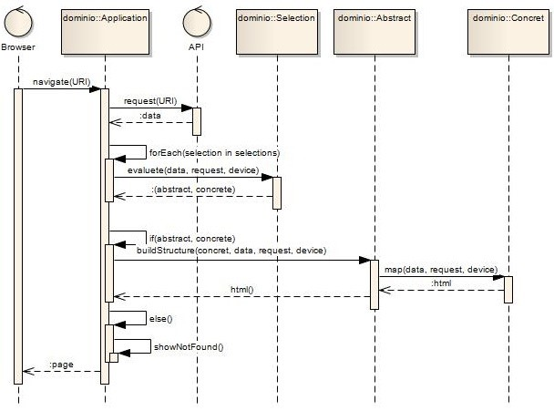
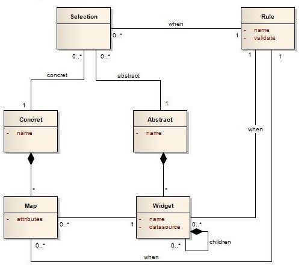
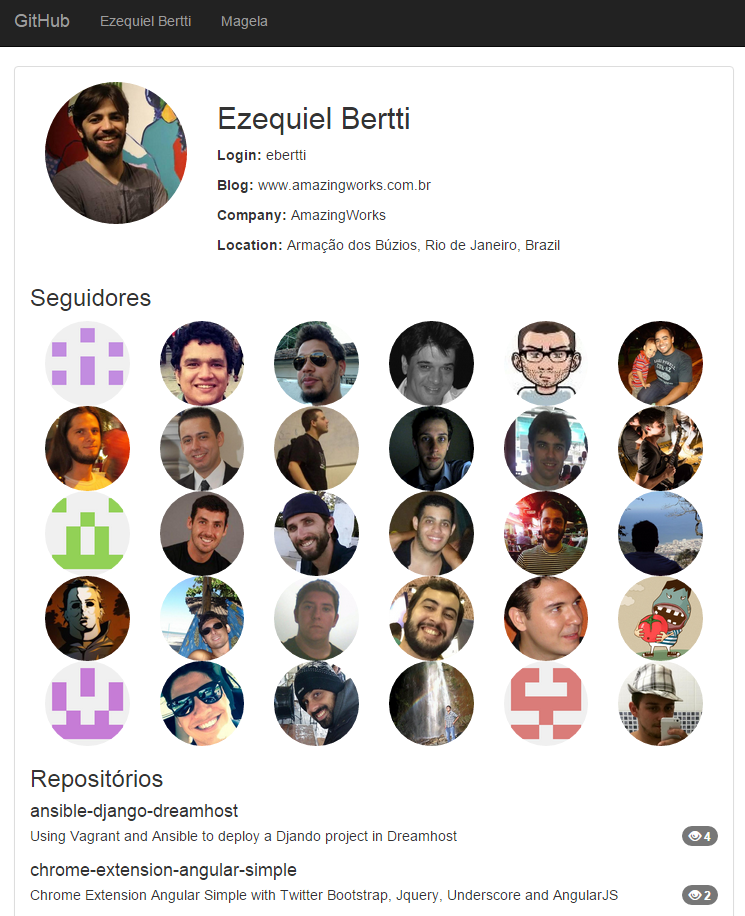

# Bem vindo ao MIRA

**Model Interface for Rest Application**

Um framework baseado em padrões que permitirá à uma aplicação qualquer definir uma interface segundo o modelo de interfaces do **SHDM**.
A funcionalidade da aplicação será ativada através de interfaces **REST**.

Através de um modelo composto por [Interface Abstrata](concrete-interface.md) e [Interface Concreta](abstract-interface.md),
o projetista da aplicação poderá montar a interface da sua aplicação e ainda utilizar [Regras](rules.md) para
a [Seleção de Interface](interface-selection.md) e mapeamento de [Widgets](widgets.md) compondo sua interface de acordo
com suas definições e adaptando-a para diversos ambientes e dispositivos.

## Sequência de execução

A partir das URIs informadas na navegação da aplicação, o MIRA fará uma requisição para a URI, selecionará a
interface abstrata, interface concrete e montará a estrutura de widgets abstratos e mapeará os widgets concretos para
exibir as informações para o usuário. Veja o passo a passo de uma navegação para um URI de uma API REST.

### Passo a passo de navegação

#### landing

Ao acessar a aplicação, o MIRA exibe a interface abstrata e concreta com os nomes de `landing`

#### mapeando uma navegação

A partir de um widget abstrato link:

    { name: 'link' }

Com ele sendo mapeado na interface concreta `landing` como um widget com uma navegação para uma URI de uma API REST:

    { name: 'link', widget: 'SimpleHtml', tag: 'a', href: 'navigate("https://www.googleapis.com/freebase/v1/search?query=PUC")' value: 'link' }

O MIRA irá exibir este widget desta forma no HTML exibido:

    <a href="#?URI=https://www.googleapis.com/freebase/v1/search?query=PUC">link</a>

#### navegando

Quando o usuário da aplicação clicar no `link`, o MIRA irá mudar o endereço do navegador para:

    http://localhost/#?URI=https://www.googleapis.com/freebase/v1/search?query=PUC

A partir do parâmetro URI desta URL, será feita uma requisição AJAX para a API REST:

    $.get("https://www.googleapis.com/freebase/v1/search?query=PUC")

Neste momento é feita a seleção das interfaces abstrata e concreta baseada nas regras de seleção mapeadas. Toda a estrutura
de widgets abstratos e concreta é montada com base nos modelos da aplicação e a interface é exibida para o usuário que está
navegando na aplicação.

## Modelo de Domínio

## Estruturas

### Regras

O projetista tem a possibilidade de centralizar as regras que serão utilizadas posteriormente pela aplicação.

    var rules = [{
        name: 'isUser',
        validate: '$data.login != null'
    },{
        name: 'haveWatch',
        validate: '$data.watchers_count > 0'
    }];

[Mais informações de construção de regras](rules.md)

----
 
### Seleção de Interface

Quando há uma navegação para uma URI, será feita a seleção de interface de acordo com os dados retornados pela URI sempre
utilizando as regras definidas pelo projetista.

    var selection = [
        {
            when: 'isUser',
            abstract: 'user'
        },{
            when: 'isRepository',
            abstract: 'repository'
        }
    ];

    
[Mais informações sobre seleção de interface](interface-selection.md)

----

### Interface Abstrata

É a estrutura da interface, onde definimos a ordem, origem dos dados e hierarquia dos elementos para que sejam mapeados
pela Interface Concreta.

    var abstracts = [ 
        { name:"user",
            widgets:[ { name:"navigation",
                children:[ { name:"navigation-list",
                    children:[ { name:"navigation-list-item" } ],
                    datasource:"obj" } ] },
                { name:"content",
                    children:[ { name:"user",
                        children:[ { name:"avatar" },
                            { name:"detail",
                                children:[ { name:"name" },
                                    { name:"login" },
                                    { name:"bio" },
                                    { name:"blog" },
                                    { name:"company" },
                                    { name:"location" } ] } ] },
                        { name:"seguidores_panel",
                            children:[ { name:"seguidores_title" },
                                { name:"seguidores",
                                    children:[ { name:"seguidor",
                                        children:[ { name:"avatar_seguidor" } ] } ],
                                    datasource:"url:<%= data.followers_url %>" },
                                { name:"seguidores_mais" } ] },
                        { name:"repositorios_panel",
                            children:[ { name:"repositorios_title" },
                                { name:"repositorios",
                                    children:[ { name:"repositorio",
                                        children:[ { name:"nome" },
                                            { name:"descricao" },
                                            { name:"box",
                                                children:[ { name:"star" },
                                                    { name:"watch" } ] } ] } ],
                                    datasource:"url:<%= data.repos_url %>" } ] } ] },
                { name:"footer",
                    children:[ { name:"footer-content" } ] } ] }
    ];

[Mais informações sobre interface abstrata](abstract-interface.md)

----

### Interface Concreta

É o mapeamento dos [Widgets Concretos](widgets.md) com a interface abstrata selecionada pela seleção de interface.

    var concret = {
        name: 'user',
        
        head: [
            {name: 'main_css', widget:'Head', href:'css/bootstrap.css', tag: 'style'},
            {name: 'secondary_css', widget:'Head', href:'css/shop.css', tag:'style'},
            {name: 'viewport', widget:'Meta', content:'width=device-width, initial-scale=1'},
            {name: 'title', widget:'Title', value: '"GitHub"'}
        ],
        
        maps: [
        { name: 'navigation', widget: 'BootstrapNavigation', value:'"GitHub"'},
        { name: 'navigation-list', widget: 'BootstrapNavigationList'},
        { name: 'navigation-list-item', widget: 'BootstrapNavigationListItem', value:'$data.name', href:'navigate($data.link)'},

        { name: 'content', widget: 'ProfileContainer' },
        { name: 'user', widget: 'SimpleHtml', class:'clearfix' },
        { name: 'avatar', widget: 'ProfileImage', value:'$data.avatar_url' },
        { name: 'detail', widget: 'SimpleHtml', class:'col-xs-12 col-sm-8' },
        { name: 'name', widget: 'SimpleHtml', tag: 'h2', value: '$data.name' },
        { name: 'login', widget: 'ProfileDetail', detail: 'Login', value: '$data.login'},
        { name: 'bio', widget: 'ProfileDetail', detail: 'Bio', value: '$data.bio'},
        { name: 'blog', widget: 'ProfileDetail', detail: 'Blog', value: '$data.blog'},
        { name: 'company', widget: 'ProfileDetail', detail: 'Company', value: '$data.company'},
        { name: 'location', widget: 'ProfileDetail', detail: 'Location', value: '$data.location'},
        { name: 'seguidores_panel', widget: 'SimpleHtml', class:'clearfix' },
        { name: 'seguidores_title', widget: 'SimpleHtml', tag: 'h3', class:'clearfix', value:'"Seguidores"'},
        { name: 'seguidores', widget: 'SimpleHtml', tag: 'div'},
        { name: 'seguidor', widget: 'SimpleHtml', tag: 'a', href: 'navigate($data.url)'},
        { name: 'avatar_seguidor', widget: 'SimpleHtml', class:'col-md-2 col-xs-3 img-circle img-responsive', tag: 'img', src: '$data.avatar_url + "s=80"', alt:'$data.login', title:'$data.login'},
        { name: 'repositorios_panel', widget: 'SimpleHtml', class:'clearfix' },
        { name: 'repositorios_title', widget: 'SimpleHtml', tag: 'h3', value:'"Repositorios"'},
        { name: 'repositorios', widget: 'SimpleHtml', tag: 'div'},
        { name: 'repositorio', widget: 'SimpleHtml', tag: 'div', class:'media'},
        { name: 'nome', widget: 'SimpleHtml', tag: 'h4', value: '$data.name', class:'media-heading'},
        { name: 'descricao', widget: 'SimpleHtml', tag: 'span', value: '$data.description'},
        { name: 'box', widget: 'SimpleHtml', tag: 'ul', class:'nav nav-pills nav-stacked pull-right'},
        { name: 'watch', widget: 'ProfileCount', icon:'eye-close', value:'$data.watchers_count'},
        { name: 'watch', widget: 'ProfileCount', icon:'eye-open', value:'$data.watchers_count', when:'haveWatch'},

        { name: 'footer', widget: 'SimpleHtml', tag:'div', class:'container' },
        { name: 'footer-content', widget: 'BootstrapFooter' }
    ]}];

[Mais informações sobre interface concreta](concrete-interface.md)

----

## Screenshot do exemplo

Navegando para uma URI da API REST do GitHub

    http://localhost/?app=github#?URI=https://api.github.com/users/ebertti

